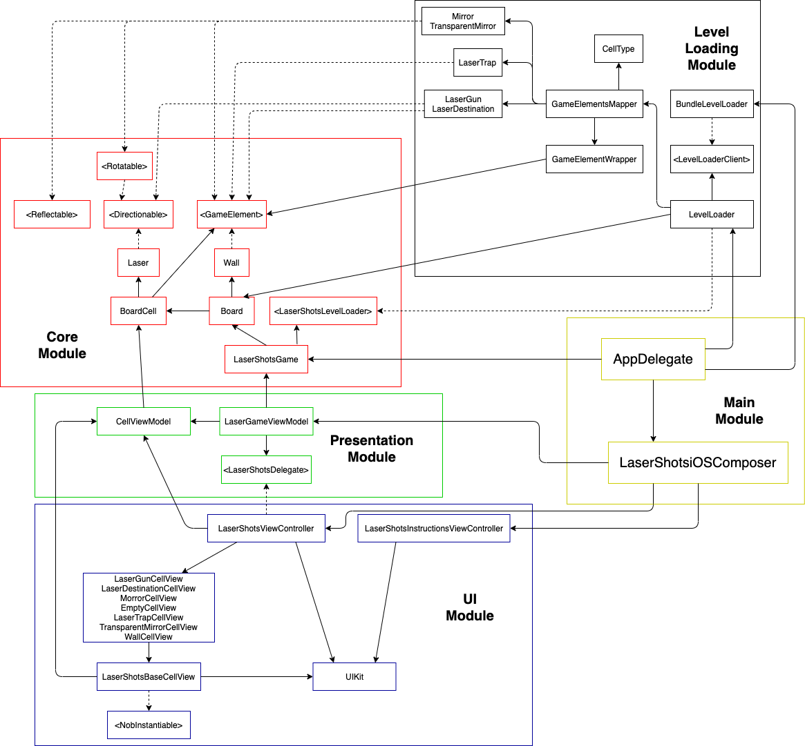

# LaserShots

## App Arquitecture

## Description
### Version of the Laser shots game. The objective is to reflect the laser beam shot with mirrors so that it reaches the laser beam destination.

## Devices
### iPhone, iPad (better displayed in iPad)

## How to install
1. Clone project
2. open Xcode and load LaserShots project file
3. Compile and run

## How to play
### Once the Start button is tapped, the laser Beam is shot. Rotate the mirrors displayed on the borad by tapping on them. They will rotate 90º clockwise with each tap. 
### If the beam hits a black hole, the game is lost and you must restart the level. The level is passed once the beam reaches the laser destination without hitting any black hole
